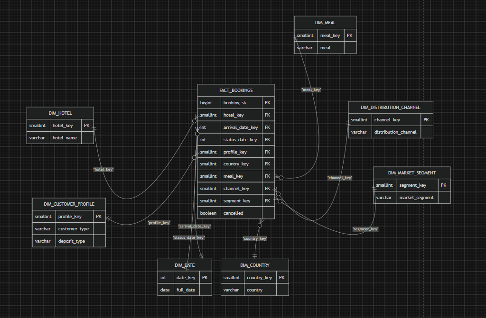

# Hotel Booking Cancellations

**Business question:** What drives booking cancellations?

## Headline

**37.1%** of bookings are cancelled or no-show (119,209 bookings after
cleaning).

| Factor | Finding |
|---|---|
| **Lead time** | Cancellation climbs from 9.6% (booked within a week) to 67.7% (booked over a year ahead) |
| **Distribution channel** | Travel agent / tour operator bookings cancel at 41.1%, vs 17.5% direct |
| **Guest history** | Repeat guests cancel at 14.7%, new guests at 37.8% |
| **Special requests** | Guests who make at least one request cancel noticeably less |

Some large effects were found and **deliberately set aside** as probable
recording artifacts rather than real behaviour — see
[Scope and limitations](#scope-and-limitations).

## Repo structure

```
├── data/
│   ├── raw/                     hotel_bookings.csv (source data)
│   └── processed/               generated by the cleaning script
├── notebooks/
│   ├── 01_data_investigation.ipynb   profiling: nulls, types, distributions, data quality issues
│   └── 02_exploratory_data_analysis.ipynb   the analysis answering the business question
├── src/
│   ├── data_cleaning.py         cleaning + feature engineering
│   └── eda_helpers.py           reusable plotting/summary helpers
├── sql/
│   ├── star_schema.sql          dimensional model DDL
│   └── erd.png                  entity-relationship diagram
├── data_quality_notes.md        every cleaning decision, with reasoning
└── requirements.txt
└── README.md
```

## How to run

```bash
pip install -r requirements.txt

# Clean the raw data
python src/data_cleaning.py
# -> data/processed/hotel_bookings_clean.parquet

# Then work through the notebooks in order
jupyter notebook notebooks/
```

`01_data_investigation.ipynb` profiles the raw data and establishes the
cleaning rules. `02_exploratory_data_analysis.ipynb` loads the cleaned output and answers the
business question.

## Data model

Star schema: `fact_bookings` (one row per booking) with seven dimensions
hotel, customer profile, date, country, meal, distribution channel, and
market segment.



`dim_date` is one physical table referenced twice, via `arrival_date_key`
and `status_date_key` (a role-playing dimension). Full DDL in
[`sql/star_schema.sql`](sql/star_schema.sql).

Note that `dim_customer_profile` is a *profile* dimension, not a customer
identity one, this dataset has no guest ID, so the key identifies a
combination of customer type, repeat-guest flag, and deposit type rather
than an individual person.

## Data quality

Cleaning removed only 181 rows (0.15%). The significant decisions were
about what **not** to remove:

- **~27% of rows look like exact duplicates.** The client confirmed each
  row is a genuine, distinct booking, so they are kept. This matters: an
  earlier version of this analysis dropped them and reported 27.5%
  cancellation instead of 37.1%.
- **Zero-night bookings are kept.** Checking `reservation_status` showed
  ~95% are completed check-outs, not cancellations. Dropping them would
  have filtered the data on a rule unrelated to the question being asked.
- **Zero-guest bookings are dropped**, since a reservation for nobody
  isn't a meaningful record. Where a booking listed children or babies but
  no adults, one adult is assumed rather than discarding the row.

Full log: [`data_quality_notes.md`](data_quality_notes.md).

## Scope and limitations

This is exploratory analysis, not a validated statistical model. Findings
describe **associations**, not proven causes.

Three large effects are excluded from the conclusions on purpose:

- **Non-refundable deposits show ~99% cancellation.** The direction makes
  no sense, guests who pay upfront should cancel *less*. Likely a
  recording issue, and needs checking against the source system.
- **Room type changed** is only known once a guest has arrived, so it
  can't predict cancellation; it just identifies who showed up.
- **Parking space requested** shows zero cancellations across every such
  booking. No exceptions at all is too clean to be real behaviour.

Also still outstanding: no confidence intervals (small groups currently
read with the same weight as large ones), only one confounding
relationship checked (lead time against channel), and no distributional
checks on ADR or lead time before relying on their averages.
